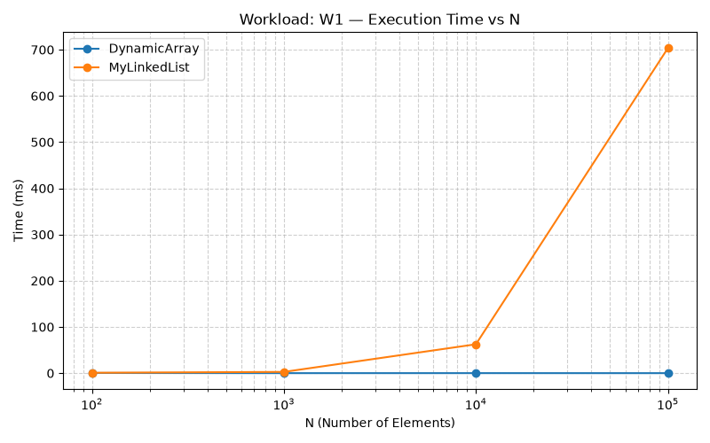
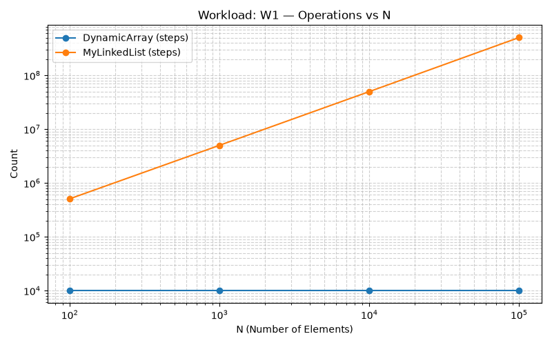
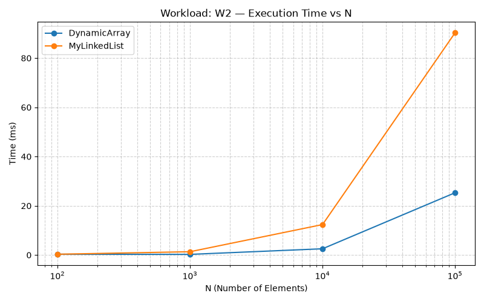
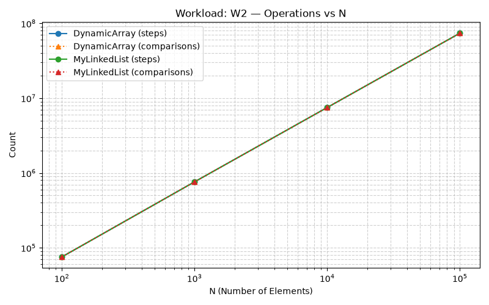
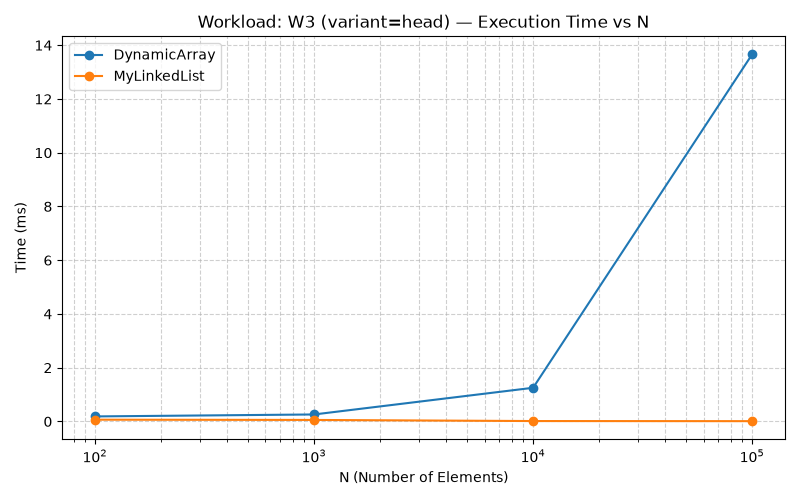
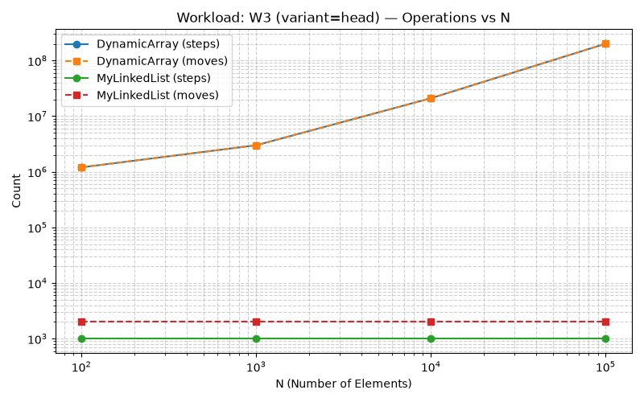
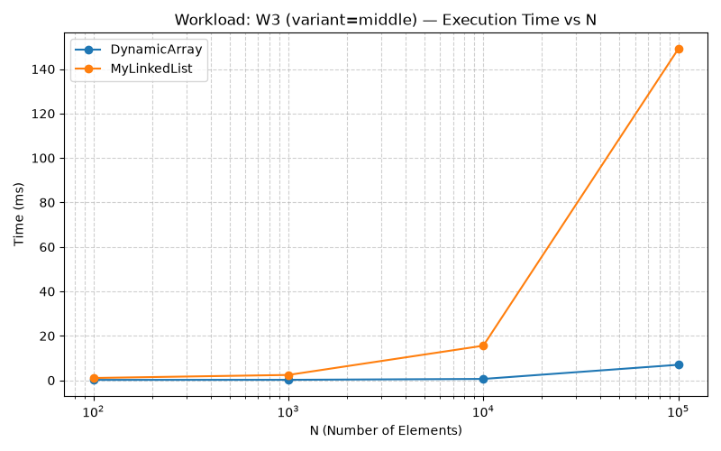
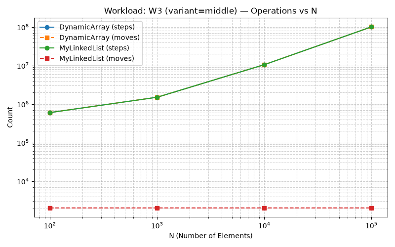
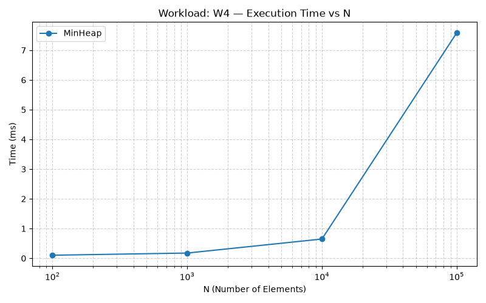
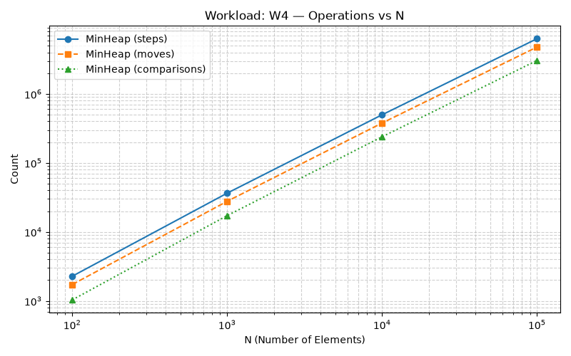

# Analysis Report: Data Structures & Benchmark Performance

## 1. Asymptotic Complexity Table

| Data Structure | Operation | Best Case $\Omega$ | Average Case $\Theta$ | Worst Case $O$ | Space Complexity | Explanation |
| :--- | :--- | :--- | :--- | :--- | :--- | :--- |
| **DynamicArray** | `add(x)` | $\Omega(1)$ | $\Theta(1)$ | $O(n)$ | $O(n)$ | $O(1)$ amortized when capacity allows; $O(n)$ during array growth. |
| | `add(index, x)` | $\Omega(1)$ | $\Theta(n)$ | $O(n)$ | $O(n)$ | Requires shifting elements to the right ($O(1)$ at tail, $O(n)$ at head/middle). |
| | `remove(index)` | $\Omega(1)$ | $\Theta(n)$ | $O(n)$ | $O(n)$ | Requires shifting elements to the left ($O(1)$ at tail, $O(n)$ at head/middle). |
| | `get(index)` | $\Omega(1)$ | $\Theta(1)$ | $O(1)$ | $O(n)$ | Direct memory address offset calculation: `base_address + index * element_size`. |
| | `contains(x)` | $\Omega(1)$ | $\Theta(n)$ | $O(n)$ | $O(n)$ | Linear scan from index 0 to $n-1$. Best case when target is at index 0. |
| **MyLinkedList** | `add(x)` | $\Omega(1)$ | $\Theta(1)$ | $O(1)$ | $O(n)$ | $O(1)$ constant time thanks to the maintained `tail` pointer. |
| | `add(index, x)` | $\Omega(1)$ | $\Theta(n)$ | $O(n)$ | $O(n)$ | $O(1)$ at head/tail; $\Theta(n)$ traversal required for middle indices. |
| | `remove(index)` | $\Omega(1)$ | $\Theta(n)$ | $O(n)$ | $O(n)$ | $O(1)$ at head; $\Theta(n)$ traversal required to reach `index - 1`. |
| | `get(index)` | $\Omega(1)$ | $\Theta(n)$ | $O(n)$ | $O(n)$ | Sequential pointer traversal from `head` to node `index`. |
| | `contains(x)` | $\Omega(1)$ | $\Theta(n)$ | $O(n)$ | $O(n)$ | Traverses nodes sequentially until value match or end of list (`null`). |
| **MinHeap** | `insert(x)` | $\Omega(1)$ | $\Theta(\log n)$ | $O(\log n)$ | $O(n)$ | Appends to end of array and performs `siftUp` along path of height $\lfloor \log_2 n \rfloor$. |
| | `peekMin()` | $\Omega(1)$ | $\Theta(1)$ | $O(1)$ | $O(n)$ | Root element at index 0 always contains the minimum element. |
| | `extractMin()` | $\Omega(1)$ | $\Theta(\log n)$ | $O(\log n)$ | $O(n)$ | Replaces root with last element and performs `siftDown` along tree height. |

---

## 2. Loop Invariants & Formal Proofs

### Proof 1: Correctness of Linear Search (`contains`)

**Algorithm Context:** Iterates through indices $0 \dots \text{size}-1$. If `array[i] == x`, returns `true`. If loop finishes, returns `false`.

* **Loop Invariant:** At the start of iteration $i$ (where $0 \le i \le \text{size}$), the target value $x$ is not present in any position $k$ such that $0 \le k < i$.
* **Initialization:** Before the first iteration ($i = 0$), the sub-array range $0 \le k < 0$ is empty. Therefore, the invariant holds vacuously.
* **Maintenance:** Assume the invariant holds at the start of iteration $i$ (i.e., $x \notin \text{array}[0 \dots i-1]$). During iteration $i$, we compare $\text{array}[i]$ with $x$. If $\text{array}[i] == x$, the method immediately returns `true`, which is correct. If $\text{array}[i] \neq x$, we now know $x \notin \text{array}[0 \dots i]$. Incrementing $i$ to $i + 1$ re-establishes the invariant for the next iteration.
* **Termination:** The loop terminates when $i == \text{size}$. By the loop invariant, $x$ is not present in any position $0 \le k < \text{size}$.
* **Conclusion:** Because the invariant guarantees $x \notin \text{array}[0 \dots \text{size}-1]$ upon loop termination, returning `false` is provably correct, demonstrating total algorithm correctness.

---

### Proof 2: Maintenance of Heap Property in `siftDown`

**Algorithm Context:** Restores Min-Heap property at root index $i$ after swapping root with last element.

* **Loop Invariant:** At the start of each iteration at node index $curr$, for all nodes $u$ in the binary tree (except possibly $curr$ relative to its children $2 \cdot curr + 1$ and $2 \cdot curr + 2$), the min-heap condition holds: $\text{array}[\text{parent}(u)] \le \text{array}[u]$.
* **Initialization:** At invocation with $curr = 0$, both left and right subtrees are valid min-heaps by inductive construction. The only potential violation occurs between $curr$ and its children.
* **Maintenance:** During iteration at $curr$, the algorithm finds $smallest = \arg\min(\text{array}[curr], \text{array}[left], \text{array}[right])$. If $smallest == curr$, then $\text{array}[curr] \le \text{array}[left]$ and $\text{array}[curr] \le \text{array}[right]$, restoring min-heap property everywhere and terminating loop. If $smallest \neq curr$, swapping $\text{array}[curr]$ with $\text{array}[smallest]$ ensures node $curr$ is now smaller than both its children. The potential violation is moved down to index $smallest$. Setting $curr = smallest$ maintains the invariant for the next iteration.
* **Termination:** Loop terminates either when $\text{array}[curr] \le \text{array}[\text{children}]$ or when $curr$ reaches a leaf node ($2 \cdot curr + 1 \ge \text{size}$).
* **Conclusion:** Upon termination, no ordering violations remain in the tree structure. Thus, the min-heap property is successfully restored across the entire structure.

---

## 3. Visualizations

### Workload W1: Random Access (`get`)

### Workload W2: Linear Search (`contains`)

### Workload W3: Insert and Remove (Head vs Middle)

### Workload W4: MinHeap (`insert` + `extractMin`)

---

## 4. Discussion & Experimental Analysis

1. **W1 (Random Access):** At $N = 100,000$, `DynamicArray` completes 10,000 random `get` calls in just **0.040 ms** ($10,000$ steps), whereas `MyLinkedList` takes **642.868 ms** and performs **503,426,459 steps**. This massive difference highlights the efficiency of direct memory indexing versus $O(N)$ node traversal.
2. **W2 (Linear Search):** At $N = 100,000$, both structures execute exactly **73,947,122 steps and comparisons**. However, `DynamicArray` runs in **19.971 ms**, while `MyLinkedList` takes **97.200 ms** (~4.9x slower).
3. **Hardware & Cache Line Effects:** The speed advantage of `DynamicArray` in W2 is explained by contiguous memory layouts. Modern CPUs prefetch memory in 64-byte **Cache Lines**. Reading `DynamicArray` loads contiguous elements straight into L1/L2 cache ahead of execution.
4. **Pointer Chasing & Object Headers:** `MyLinkedList` nodes are dynamically allocated on the JVM heap. Traversing the list causes **Pointer Chasing** — the CPU must wait for each node's `next` pointer before reading the next memory address, leading to frequent CPU Cache Misses. Furthermore, each Java `Node` object incurs a **16–24 byte Object Header** overhead, consuming vastly more memory bandwidth than a primitive `int[]` array.
5. **Garbage Collector (GC) Impact:** Allocating 100,000 distinct `Node` objects for `MyLinkedList` creates substantial pressure on the JVM Garbage Collector. The GC must track and manage each individual heap object, whereas `DynamicArray` requires only a single contiguous array object for all numbers, minimizing memory management overhead.
6. **W3 (Insert/Remove at Head):** At $N = 100,000$, `MyLinkedList` handles 1,000 head operations in **0.012 ms** ($1,000$ steps, $2,000$ moves) due to $O(1)$ reference updates. `DynamicArray` takes **13.748 ms** and executes **201,100,000 moves** due to element shifting.
7. **W3 (Insert/Remove at Middle):** At $N = 100,000$, `DynamicArray` completes in **6.879 ms** ($100,600,500$ moves), while `MyLinkedList` takes **150.030 ms** ($100,498,500$ steps). Although both scale with $O(N)$, array memory shifting via optimized CPU instructions is dramatically faster than linked list traversal to index $N/2$.
8. **W4 (MinHeap Scaling):** At $N = 100,000$, `MinHeap` performs 100,000 inserts and 100,000 extracts in **7.646 ms**. Total operations stand at **6,318,261 steps** (which is greater than $6 \times 10^6$), **4,784,540 moves**, and **3,059,125 comparisons**, which perfectly conforms to the theoretical $O(N \log N)$ bound ($N \log_2 N \approx 1.66 \times 10^6$ element comparisons multiplied by multi-step sift operations).
9. **When to use DynamicArray:** Ideal for general-purpose storage, frequent read access (`get`), linear iteration, and cache efficiency.
10. **When to use MyLinkedList:** Best strictly when frequent insertions and deletions occur at the boundaries (`head`), or when building queues/stacks without index access.
11. **When MinHeap is Better:** A MinHeap is far superior when you need to continuously extract the minimum element from a dynamically changing set of items (such as a priority task queue). In this case, `extractMin` runs in $O(\log n)$ time, which is vastly faster than scanning an entire unorganized array for the minimum in $O(n)$ time.